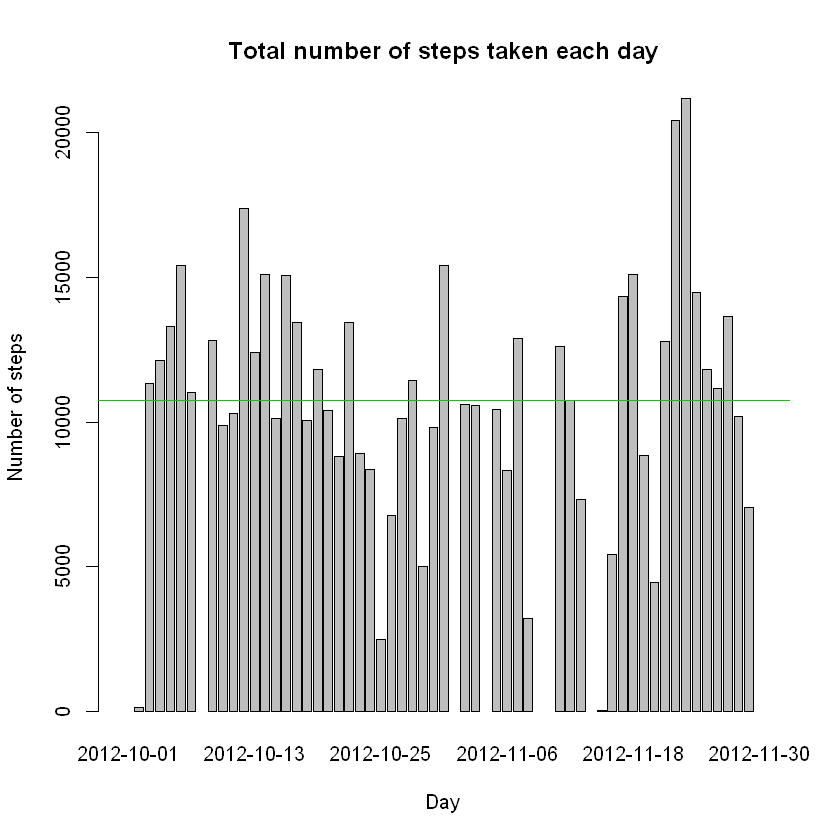
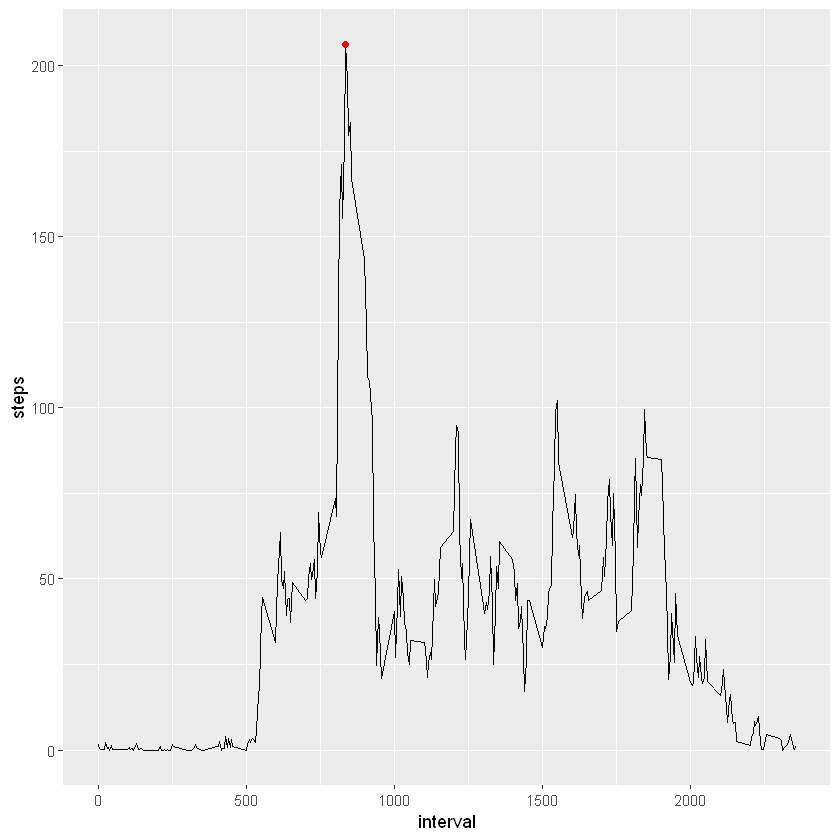
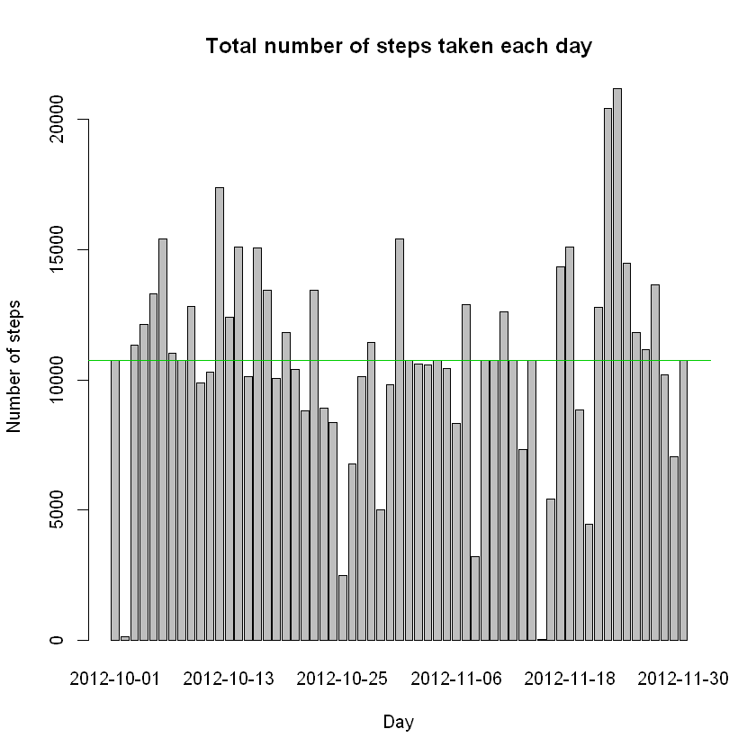
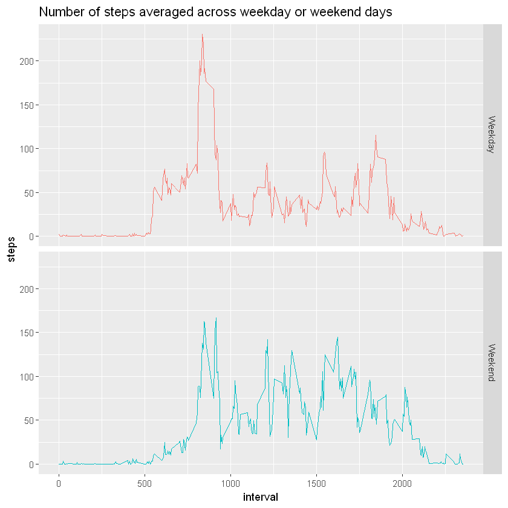

# Project 1
===========================================================

### Loading and preprocessing the data

1. Load the data (i.e. read.csv()).
2. Transform the date from character to Date format suitable for the analysis.


```R
#Load the library
library(ggplot2)
library(reshape2)
library(dplyr)
```


```R
act <- read.csv("activity.csv")  #Load the data 
act$date<-as.Date(act$date, "%Y-%m-%d")  #Transform the date from character to Date format  
```

### What is mean total number of steps taken per day?

In this part, we ignore the missing values in the dataset.

3. Calculate the total number of steps taken per day.

4. Make a histogram of the total number of steps taken each day.

5. Calculate the mean and median of the total number of steps taken per day.


```R
## Calculate the total number of steps taken per day.
totalsteps<-tapply(act$steps,act$date,sum,na.rm=FALSE) #Calculate the total number of steps taken per day.
```


```R
## Make a histogram of the total number of steps taken each day.
barplot(totalsteps,xlab="Day",ylab="Number of steps",main="Total number of steps taken each day")
abline(h=mean(totalsteps,na.rm=TRUE), col=2)
abline(h=median(totalsteps, na.rm=TRUE),col=3)
```


    

    


```R
mean(totalsteps,na.rm=TRUE) # Calculate the mean of the total number of steps taken per day.
median(totalsteps,na.rm=TRUE) # Calculate the median of the total number of steps taken per day.
```


10766.1886792453


10765


## What is the average daily activity pattern?
6. Make a time series plot of the 5-minute interval (x-axis) and the average number of steps taken, averaged across all days (y-axis).
7. Which 5-minute interval, on average across all the days in the dataset, contains the maximum number of steps?


```R
## Calculate the average number of steps taken in each 5-minute interval, across all days.
Means <- dcast(melt(act, id = "interval",measure.vars="steps"), interval ~ variable, mean, na.rm=TRUE) 
# Is the same that do: Means<-summarize(group_by(act,interval), aas=mean(steps, na.rm = TRUE))
## Make a plot.
ggplot(Means, aes(interval,steps)) + geom_line() + geom_point(aes(x=interval[which.max(steps)],y=max(steps)),color=2)
```


    

    


```R
Means$interval[which.max(Means$steps)] # This shows the 5-minute interval contains the maximum average number of steps.
```


835


## Imputing missing values

Note that there are a number of days/intervals where there are missing values (coded as NA). The presence of missing days may introduce bias into some calculations or summaries of the data.

8. Calculate and report the total number of missing values in the dataset (i.e. the total number of rows with NAs)

9. Devise a strategy for filling in all of the missing values in the dataset. The strategy does not need to be sophisticated. For example, you could use the mean/median for that day, or the mean for that 5-minute interval, etc.

9. Create a new dataset that is equal to the original dataset but with the missing data filled in.

10. Make a histogram of the total number of steps taken each day and Calculate and report the mean and median total number of steps taken per day. Do these values differ from the estimates from the first part of the assignment? What is the impact of imputing missing data on the estimates of the total daily number of steps?


```R
table(is.na(act$steps)) # Calculate the total number of missing values in the dataset (i.e. the total number of rows with NAs)
```


    
    FALSE  TRUE 
    15264  2304 


There are 2304 rows with NAs

The strategy is filling all the missin values in the dataset with the mean for that 5-minute interval, as follows:

By Step 6, we have that *Means* is the data frame that with the average of the number of steps in each 5-minute interval accros all days. Then we fill the missing values with the correspondig mean values in each interval. 


```R
COPY<-data.frame(act)  #Create a copy of the dataset

## Fill the new data frame in the missing values
for( i in 1:nrow(COPY)){
    if(is.na(COPY[i,1])){
        if(i%%288==0){COPY[i,1]<-Means[288,2]}
        else{COPY[i,1]<-Means[i%%288,2]}
    }
}
```


```R
## Calculate the total number of steps taken per day in the new dataset COPY.
totalstepsCOPY<-tapply(COPY$steps,COPY$date,sum,na.rm=FALSE) 
## Make a histogram of the total number of steps taken each day in the new dataset.
barplot(totalstepsCOPY,xlab="Day",ylab="Number of steps",main="Total number of steps taken each day")
abline(h=mean(totalstepsCOPY,na.rm=TRUE), col=2)
abline(h=median(totalstepsCOPY, na.rm=TRUE),col=3)
```


    

    


```R
mean(totalstepsCOPY,na.rm=TRUE) # Calculate the mean of the total number of steps taken per day in the new dataset.
median(totalstepsCOPY,na.rm=TRUE) # Calculate the median of the total number of steps taken per day in the new dataset.
median(totalstepsCOPY,na.rm=TRUE)-median(totalsteps,na.rm=TRUE) #Differenc between the median of the datasets
```


10766.1886792453


10766.1886792453


1.1886792452824


### Conclusion
- Do these values differ from the estimates from the first part of the assignment? The mean is equal, the median differ around 1.18 steps 

- What is the impact of imputing missing data on the estimates of the total daily number of steps? There was no big impact on the dataset when we replaced the missing data

## Are there differences in activity patterns between weekdays and weekends?

For this part the weekdays() function may be of some help here. Use the dataset with the filled-in missing values for this part.

12. Create a new factor variable in the dataset with two levels – “weekday” and “weekend” indicating whether a given date is a weekday or weekend day.

13. Make a panel plot containing a time series plot (i.e. type = "l") of the 5-minute interval (x-axis) and the average number of steps taken, averaged across all weekday days or weekend days (y-axis). See the README file in the GitHub repository to see an example of what this plot should look like using simulated data.


```R
Sys.setlocale(locale = "English")  ## This is for obtain the days names in english.
```


'LC_COLLATE=English_United States.1252;LC_CTYPE=English_United States.1252;LC_MONETARY=English_United States.1252;LC_NUMERIC=C;LC_TIME=English_United States.1252'


```R
## Create a new factor variable in the dataset with two levels – “weekday” and “weekend” 
COPY<-mutate(COPY,day=factor(weekdays(act$date),
                             levels=c("Monday", "Tuesday", 'Wednesday','Thursday','Friday','Saturday','Sunday' ),
                             labels=c("Weekday","Weekday","Weekday","Weekday","Weekday","Weekend","Weekend")) )
```


```R
## Calculate the average number of steps taken in each 5-minute interval, across all weekday days or weekend days.
MeansbyDay <- dcast(melt(COPY, id = c("interval","day"),measure.vars="steps"), interval + day ~ variable, mean) 
## Make a plot.
ggplot(MeansbyDay, aes(interval,steps)) + geom_line(aes(color = day))  + facet_grid(day~.) + theme(legend.position='none') + labs(title = "Number of steps averaged across weekday or weekend days")
```


    

    

